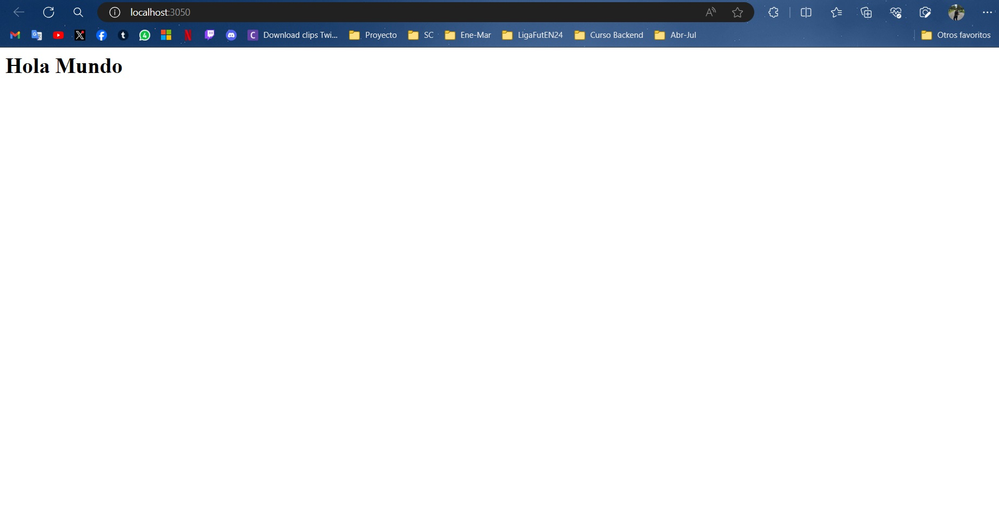
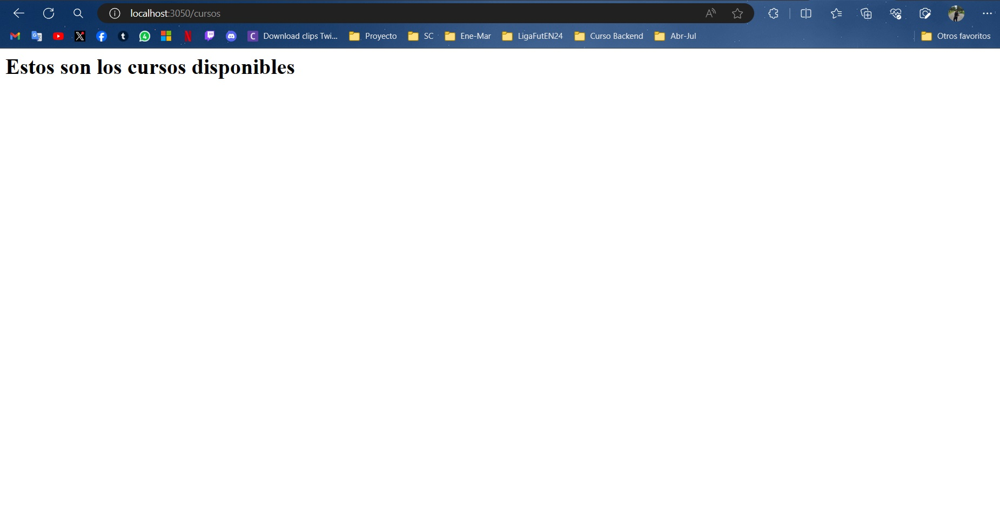
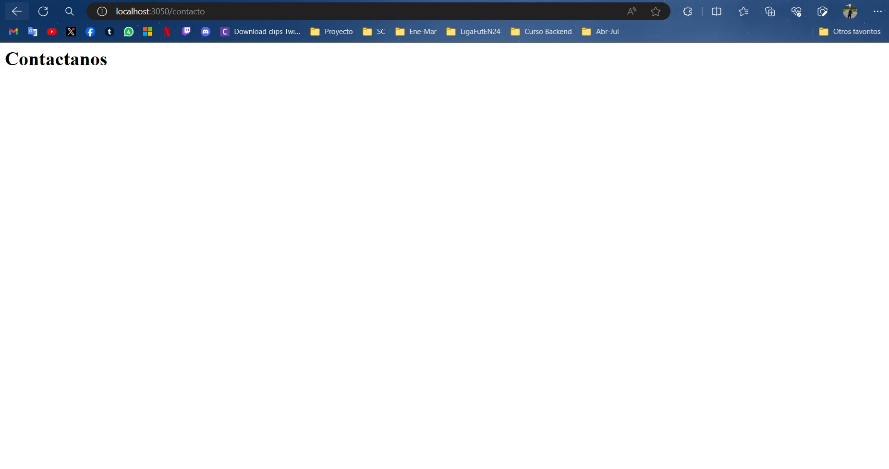
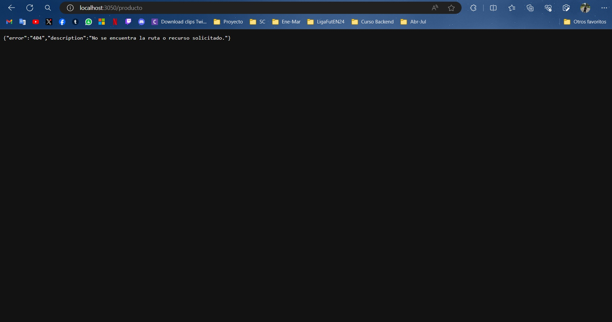

# Primera aplicación con express

Servidor con nodejs + express + nodemon

## Dependencias instaladas
- Express --> npm i express || npm install express
- Nodemon --> npm i --save-dev nodemon || npm install --save-dev nodemon

## Ejecución del programa

En el package.json ver qué scripts existen para ejecutar:

```
"scripts": {
    "start": "node --watch index.js",
    "dev": "nodemon index.js",
}
```

Se podrá ejecutar el proyecto con:
- npm start
- npm run dev

## Capturas de Pantalla

Página principal (home page):



Página de Cursos:



Página de Contacto:



Página no encontrada:


