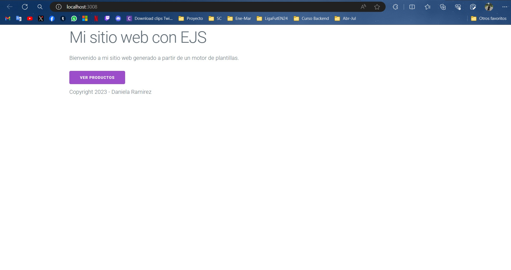
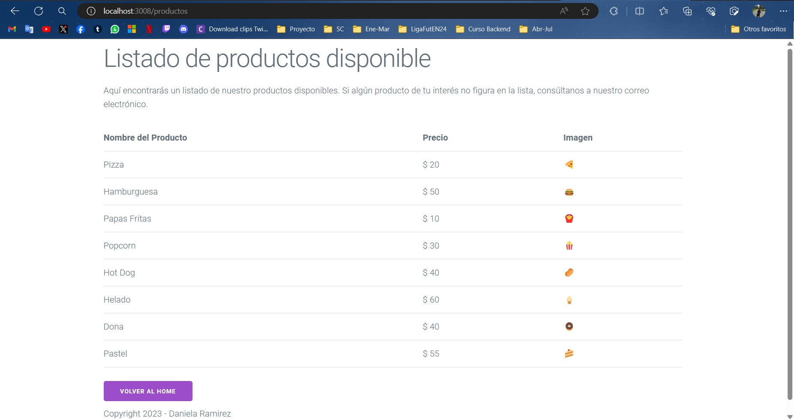
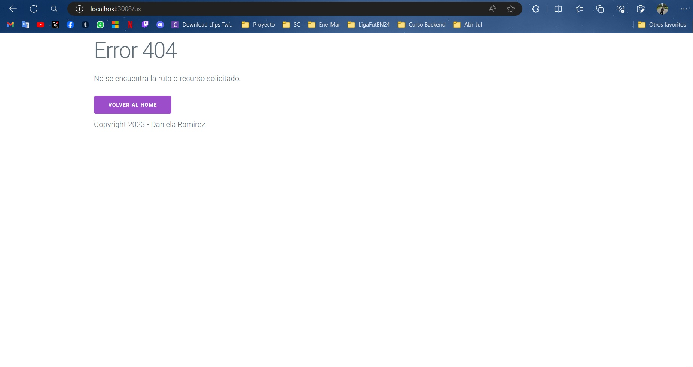

# Aplicación con express

Servidor con nodejs + express

## Dependencias instaladas
- Express --> npm i express || npm install express

## Ejecución del programa

En el package.json ver qué scripts existen para ejecutar:

```
"scripts": {
    "start": "node index.js",
    "dev": "node index.js",
}
```

Se podrá ejecutar el proyecto con:
- npm start
- npm run dev

## Capturas de Pantalla

Ruta raíz **(`/`)**:



Ruta Productos **(`/productos`)**:



Ruta Inexistente **(`/*`)**:

