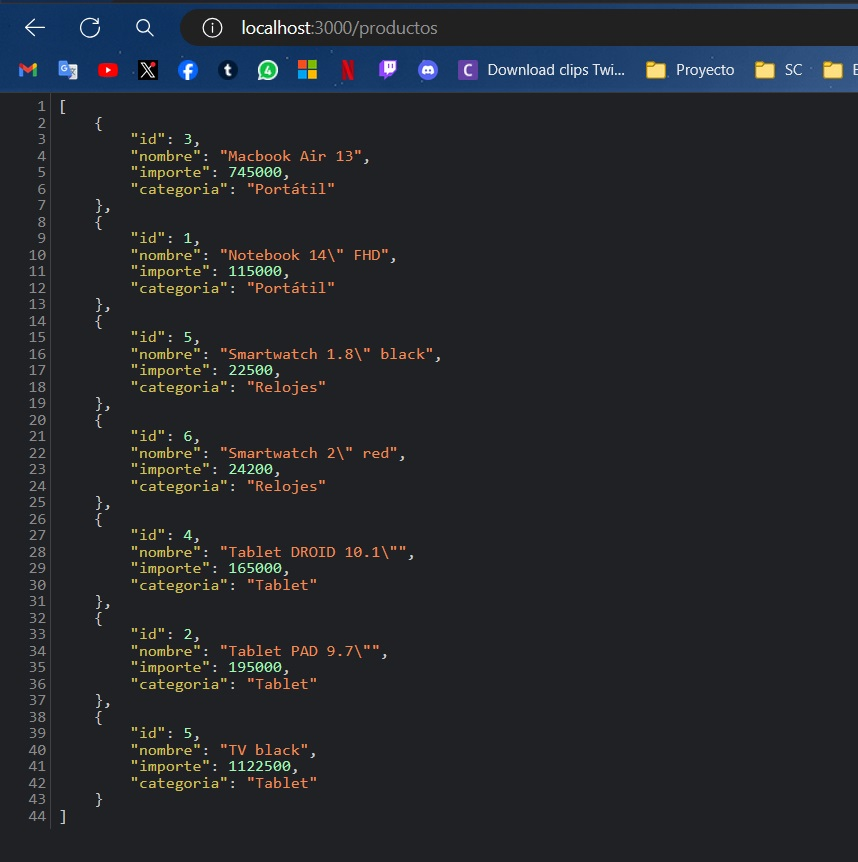
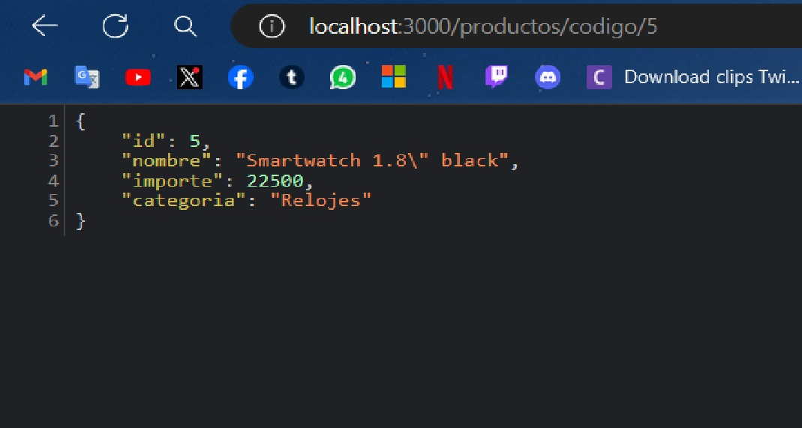
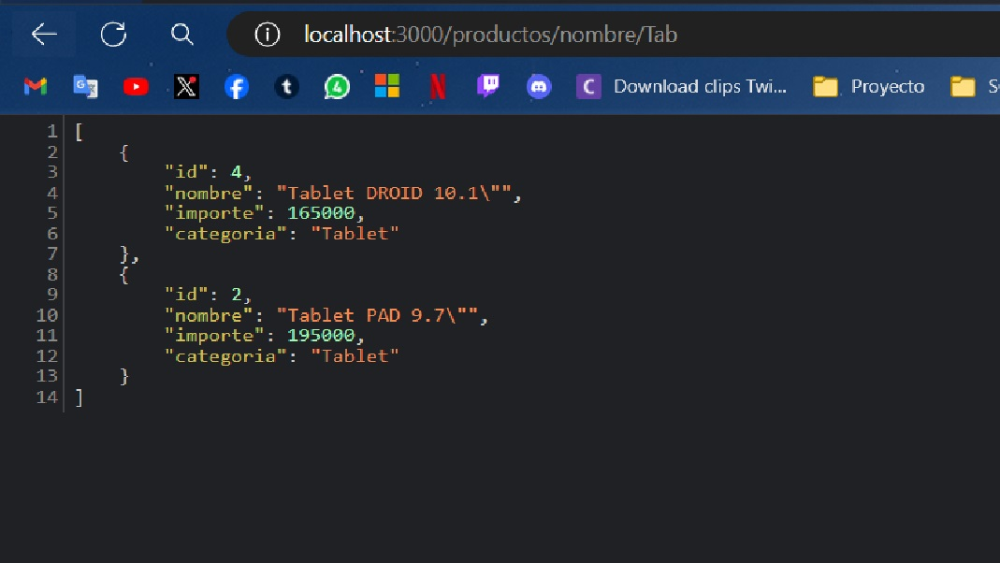

# Aplicación con express

Servidor con nodejs + express. 
En este proyecto se construyó un backend que sirve datos, mediante diferentes endpoints, a
partir de un array de objetos. Éste contendrá las siguientes rutas:
-   ● /productos
-   ● /productos/codigo/:id
-   ● /productos/nombre/:nombre

## Dependencias instaladas
- Express --> npm i express || npm install express
- Nodemon --> npm i nodemon || npm install nodemon

Para instalar todas las dependencias solo es necesario ejecutar:

```
npm install
```

## Ejecución del programa

En el package.json ver qué scripts existen para ejecutar:

```
"scripts": {
    "start": "nodemon index.js",
    "dev": "nodemon index.js",
}
```

Se podrá ejecutar el proyecto con:
```
npm start
```
o
```
npm run dev
```

## Capturas de Pantalla

Endpoint de todos los cursos **"/productos"**:



Endpoint por id **“/productos/codigo/:id”**:



Endpoint por nombre **“/productos/nombre/:nombre”**:

