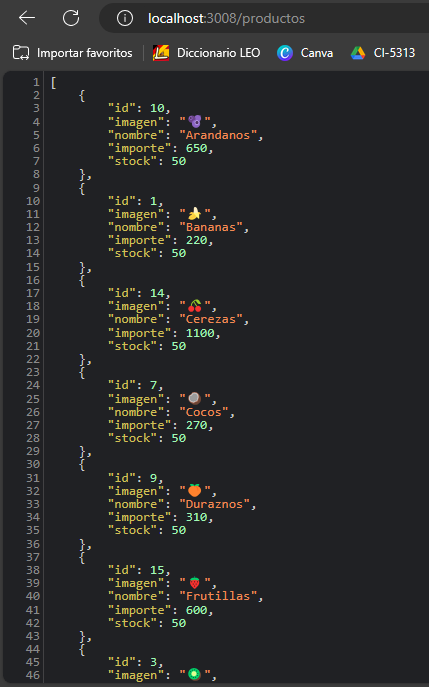
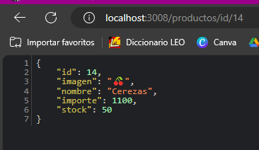
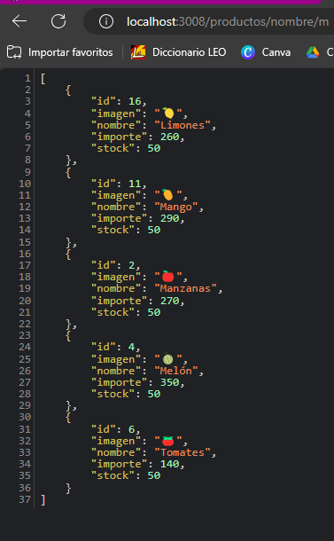

# Aplicación con express

Servidor con nodejs + express

## Dependencias instaladas
- Express --> npm i express || npm install express

## Ejecución del programa

En el package.json ver qué scripts existen para ejecutar:
-npm install

```
"scripts": {
    "start": "nodemon index.js",
    "test": "echo \"Error: no test specified\" && exit 1"
}
```

Se podrá ejecutar el proyecto con:
- npm start

## Capturas de Pantalla

Endpoint de todos los productos **"/productos"**:



Endpoint por id **“/productos/id/:id”**:



Endpoint por nombre **“/productos/nombre/:nombre”**:

