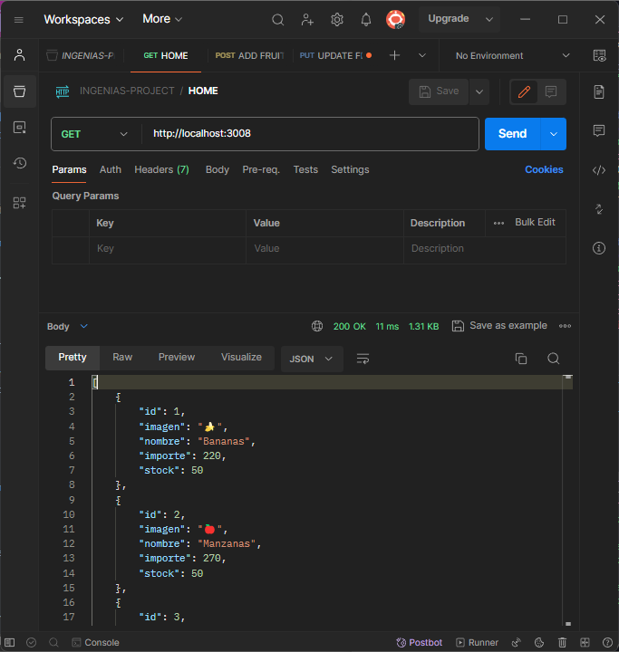
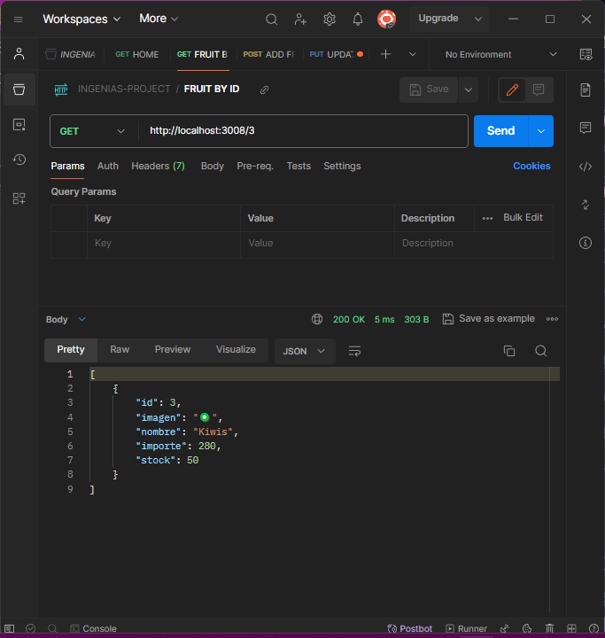
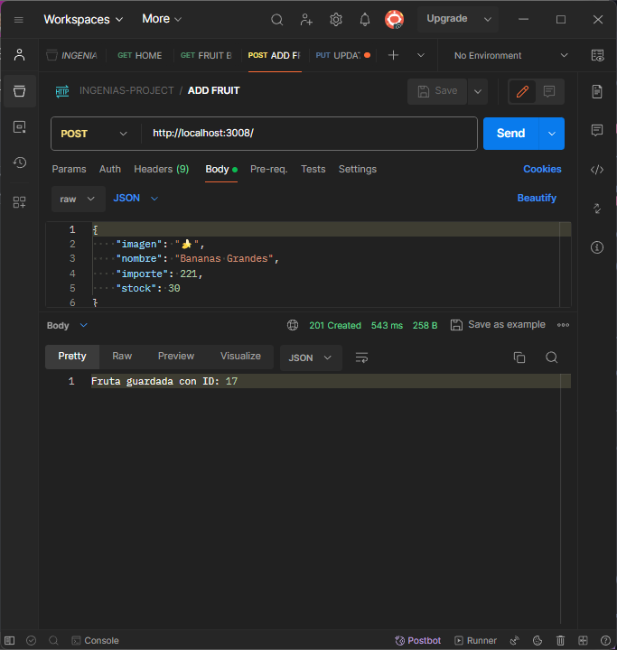
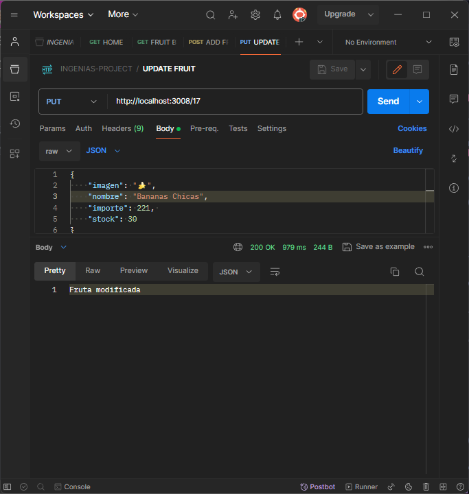
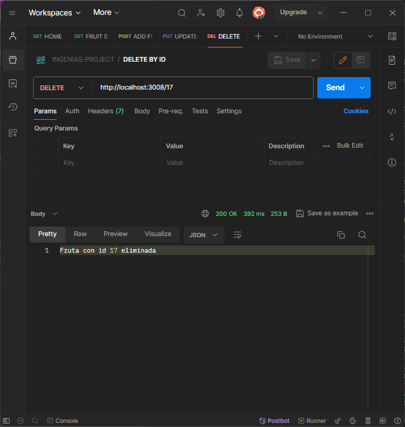

# Aplicación con express

Servidor con nodejs + express

## Dependencias instaladas
- Express --> npm i express || npm install express

## Ejecución del programa

En el package.json ver qué scripts existen para ejecutar:
-npm install

```
"scripts": {
    "start": "nodemon server.js",
    "test": "echo \"Error: no test specified\" && exit 1"
}
```

Se podrá ejecutar el proyecto con:
- npm start

## Capturas de Pantalla

Endpoint para obtener todos los productos **"/"**:



Endpoint para obtener un producto por su id **“/:id”**:



Endpoint para agregar un producto **“/:id”**:



Endpoint para actualizar la informacion de un producto por su id **“/:id”**:



Endpoint para eliminar un producto por su id **“/:id”**:

