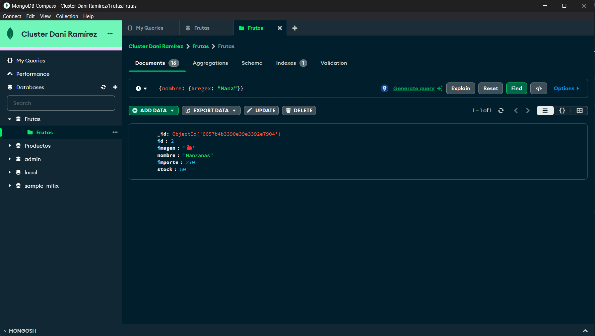
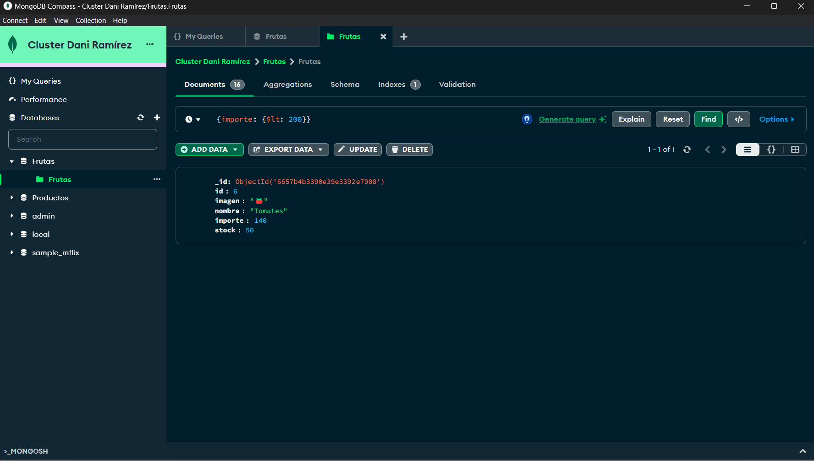
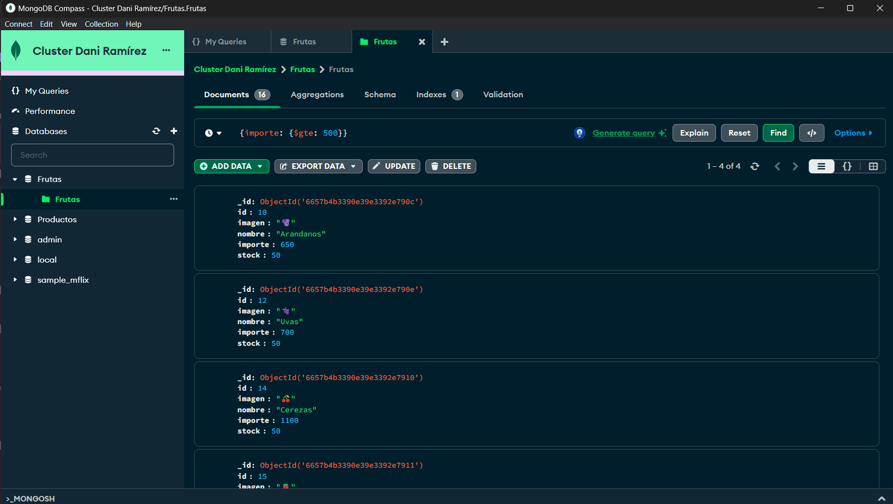
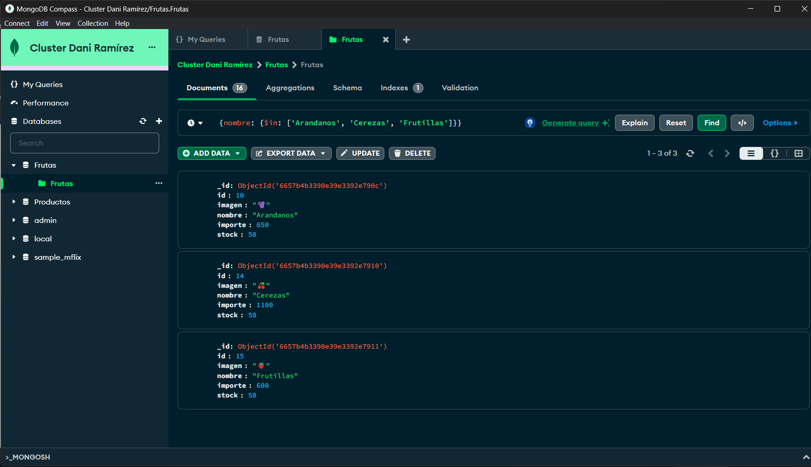
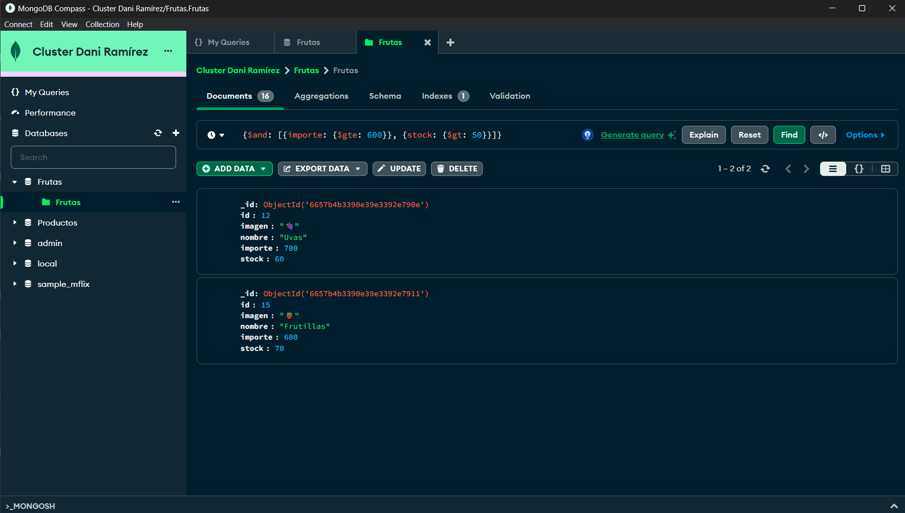
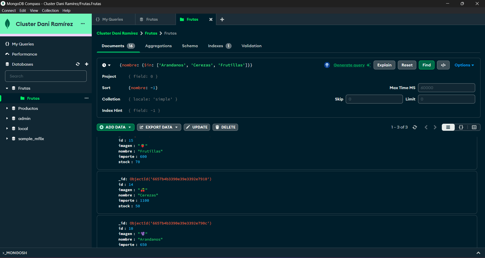
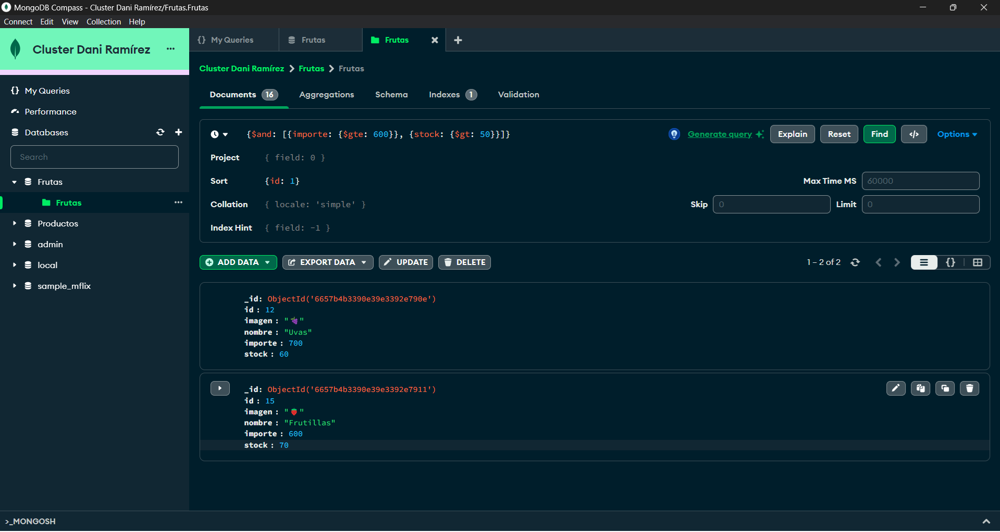

# 💻 Queries Clase 12 

A continuación, se podrán observar capturas de pantalla de las queries en MongoDB Compass

1. Busca las frutas donde su nombre comienza con 'Manz' (recuerda /regex/)

 
  

2. Busca las frutas que tienen un precio menor a 200

 
  

3. Busca las frutas que tienen un precio mayor o igual a 500

 
  

4. Buscar las frutas que tienen los nombres 'Arándanos', 'Cerezas’, 'Frutillas’

 
  

5. Buscar las frutas que tienen un precio mayor o igual a 600 y su stock superior a 50

Para esta consulta cambié el stock de las frutas que tuviesen un importe mayor a 600, en mi caso escogí 'Uvas' y 'Frutillas'. Actualicé el stock de cada una en el Compass dándole al lapicito que aparece en el lado derecho de cada fruta, donde dice 'Editar documento'.

 
  

6. Repite el punto 2, agregando un ordenamiento por el nombre, de forma ascendente

 
  

7. Repite el punto 4, agregando un ordenamiento por el nombre de forma descendente

 
  

8. repite el punto 5, agregando un ordenamiento por el id de forma ascendente

 
  

