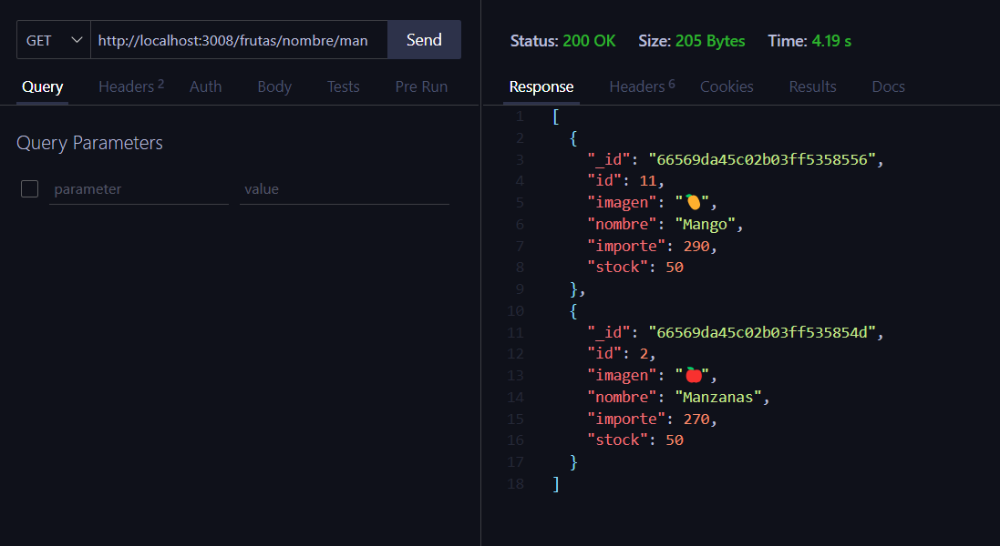

# Aplicación con express

Servidor con Nodejs + Express + MongoDB

## Dependencias instaladas
- Express --> npm i express || npm install express
- MongoDB --> npm i mongodb || npm install mongodb
- Dotenv  --> npm i dotenv  || npm install dotenv
- Nodemon --> npm i nodemon || npm install nodemon

Para instalar todas las dependencias solo hace falta ejecutar:

```
npm install
```

## Ejecución del programa

```
npm start
```

## Capturas de Pantalla

Endpoint de las frutas por nombre **"/frutas/nombre/:nombre"**:



Endpoint de las frutas por precio **“/frutas/precio/:precio”**:

