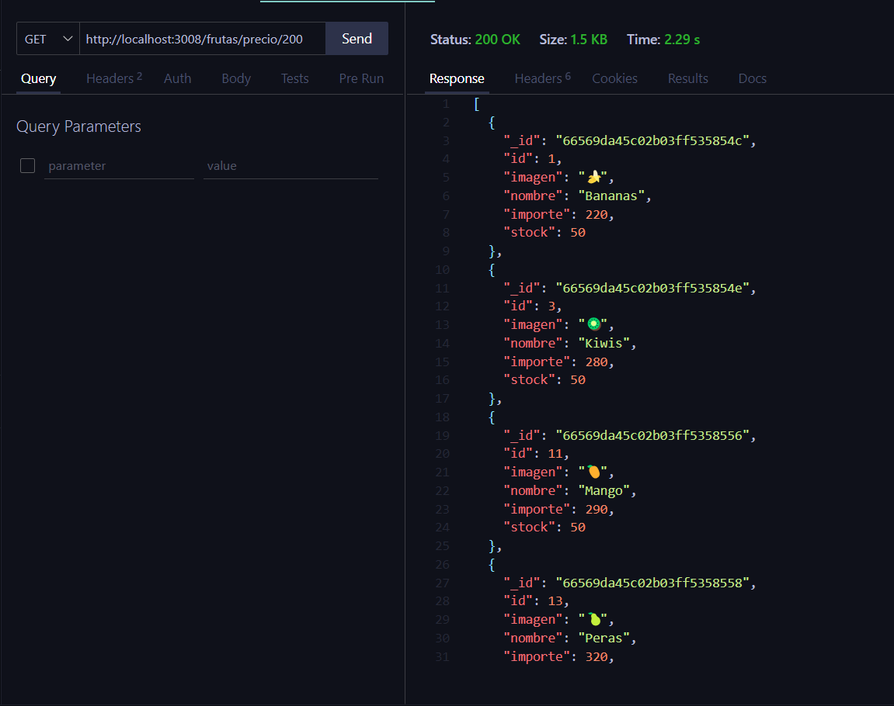
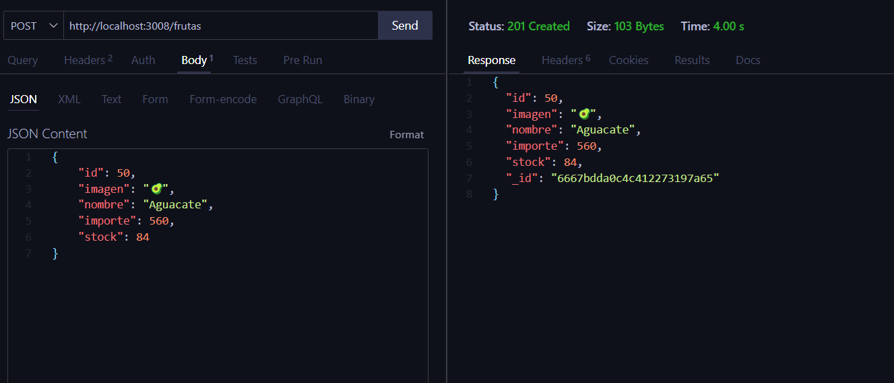
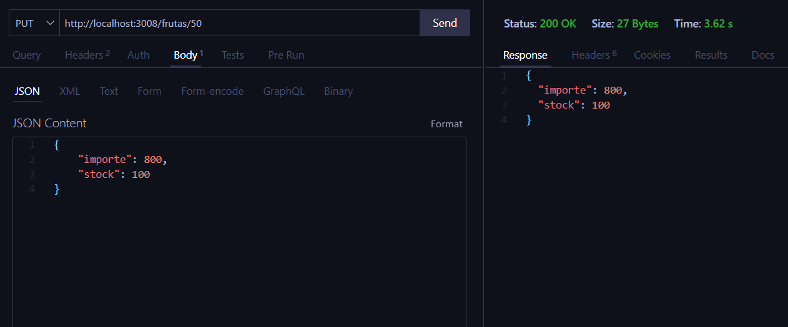
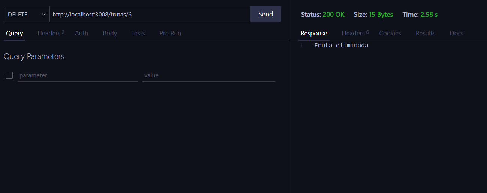
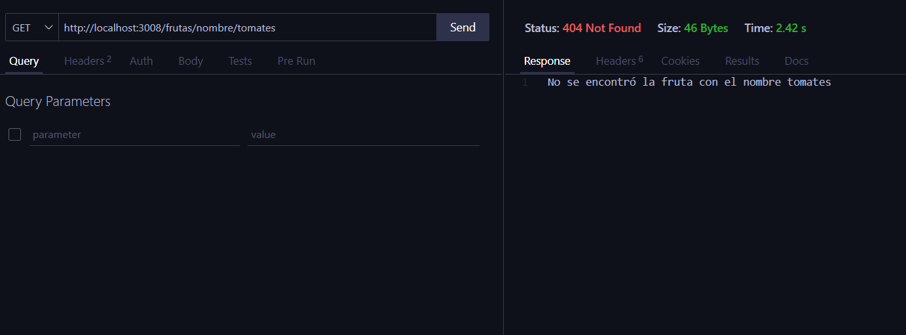

# Aplicación con express

Servidor con Nodejs + Express + MongoDB

## Dependencias instaladas
- Express --> npm i express || npm install express
- MongoDB --> npm i mongodb || npm install mongodb
- Dotenv  --> npm i dotenv  || npm install dotenv
- Nodemon --> npm i nodemon || npm install nodemon
- Body-Parser --> npm i body-parser || npm install body-parser

Para instalar todas las dependencias solo hace falta ejecutar:

```
npm install
```

## Ejecución del programa

```
npm start
```

## Capturas de Pantalla

Endpoint de las frutas por nombre **"/frutas/nombre/:nombre"**:


Endpoint de las frutas por precio **“/frutas/precio/:precio”**:



Endpoint para agregar una nueva fruta **"/frutas"**:



Endpoint para actualizar la info de una fruta **“/frutas/:id”**:



Luego, al obtener la fruta se ve la información actualizada:


Endpoint para eliminar una fruta **"/frutas/:id"**



Luego, al obtener la fruta se ve que la fruta ya no sale:

