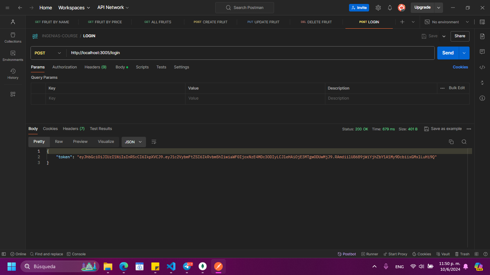
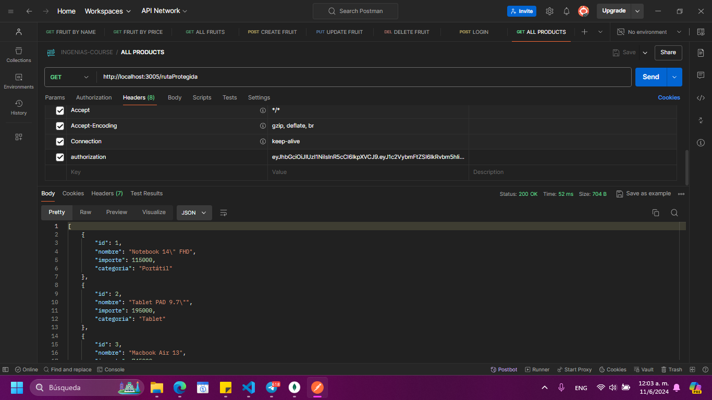

# Aplicación con express

Servidor con JWT

## Dependencias instaladas
-  npm install express dotenv jsonwebtoken

## Ejecución del programa

En el package.json ver qué scripts existen para ejecutar:
-npm install

```
  "scripts": {
    "dev": "nodemon",
    "prod": "node --watch index.js",
    "test": "echo \"Error: no test specified\" && exit 1"
  }
```

Se podrá ejecutar el proyecto con:
- npm run dev

## Capturas de Pantalla

Endpoint para iniciar sesion **"/login"**:



Endpoint para obtener todos los productos  **"/rutaProtegida"**:



