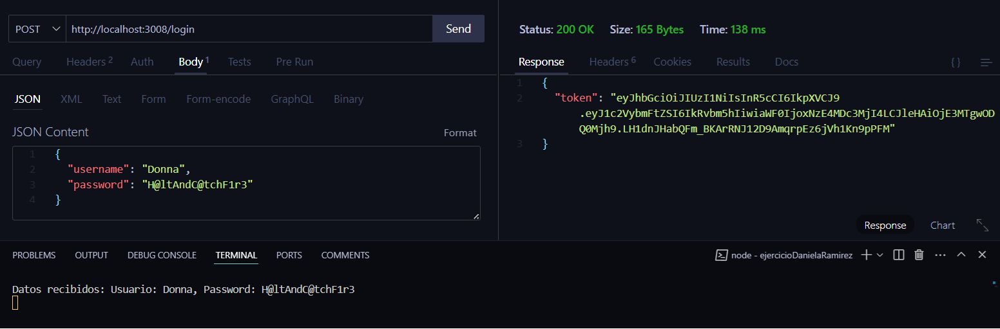
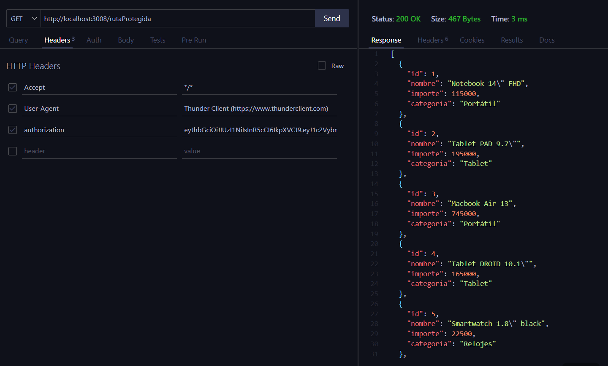

# Aplicación con express

Servidor con Nodejs + Express

## Dependencias instaladas
- Express --> npm i express || npm install express
- Dotenv  --> npm i dotenv  || npm install dotenv
- Nodemon --> npm i nodemon || npm install nodemon
- Json Web Token --> npm i jsonwebtoken || npm install jsonwebtoken

Para instalar todas las dependencias solo hace falta ejecutar:

```
npm install
```

## Ejecución del programa

```
npm run dev
```

## Capturas de Pantalla

Endpoint de Login **"/login"**:



Endpoint de la ruta protegida con el JWT **“/rutaProtegida”**:


