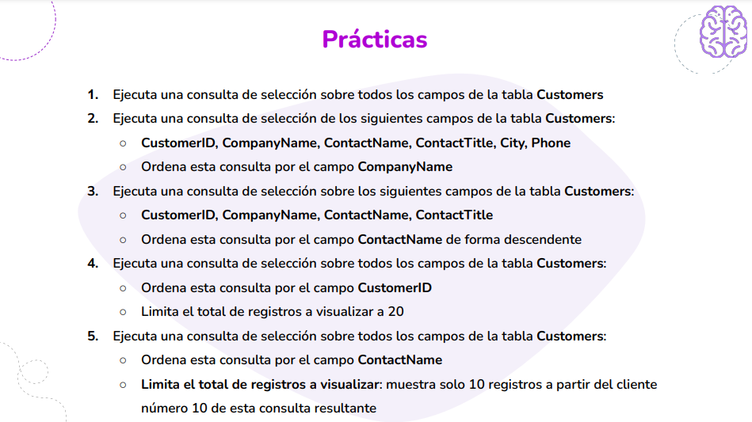
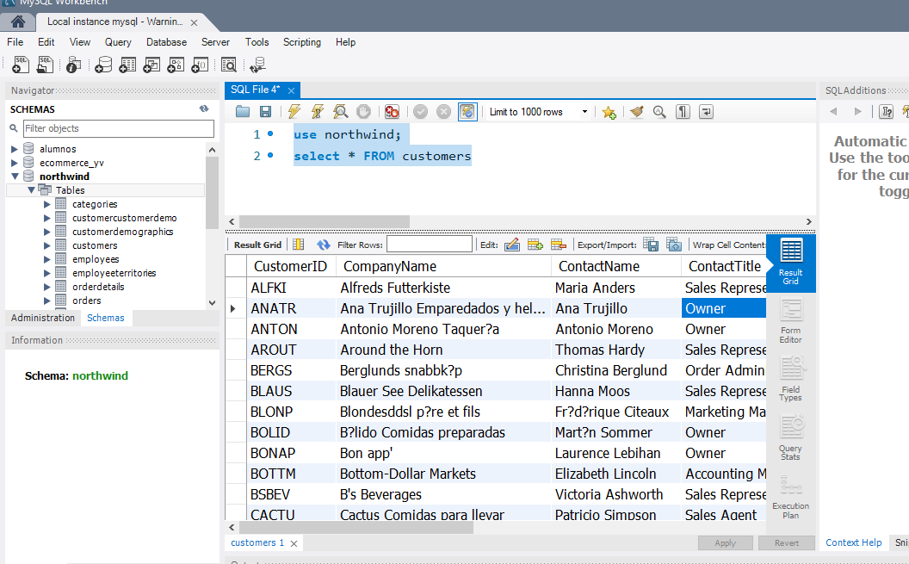
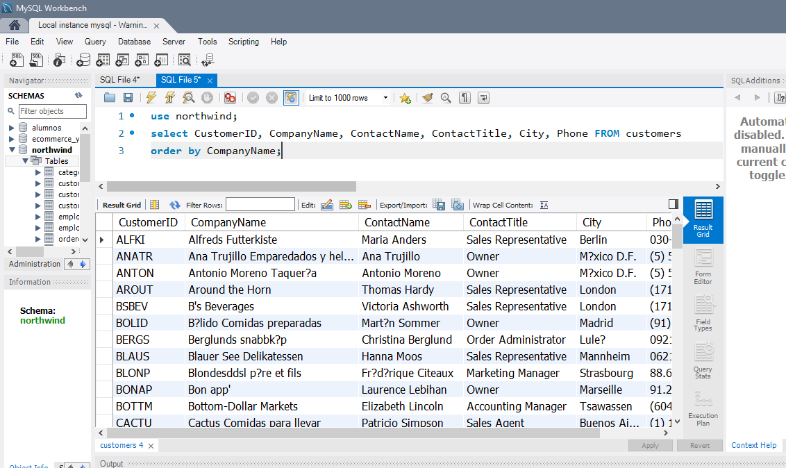
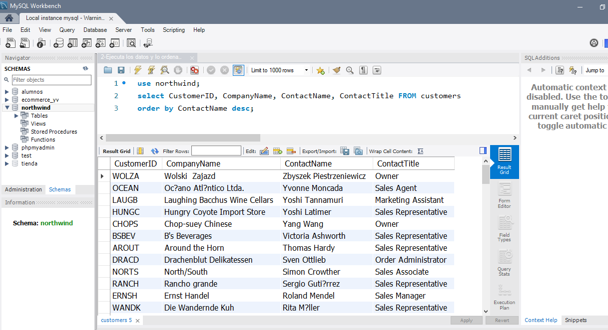
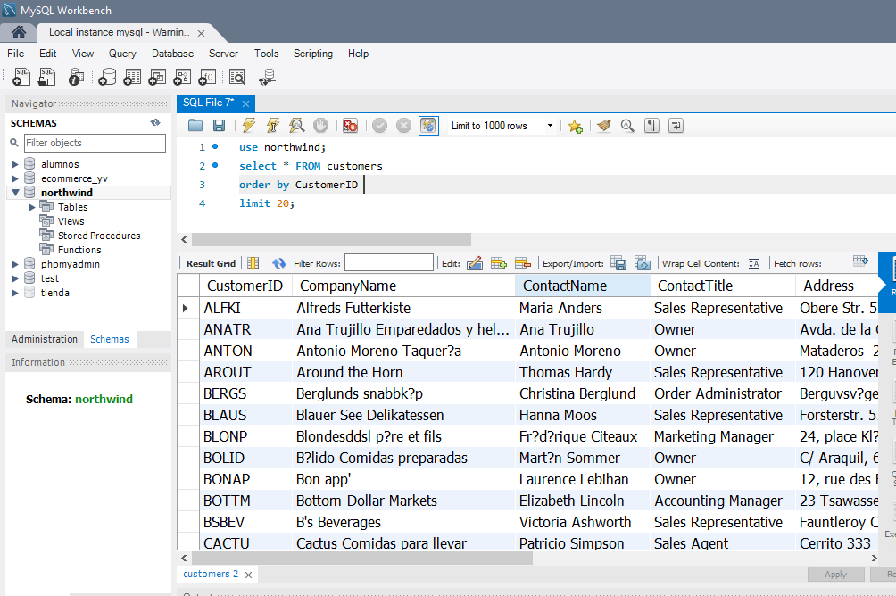
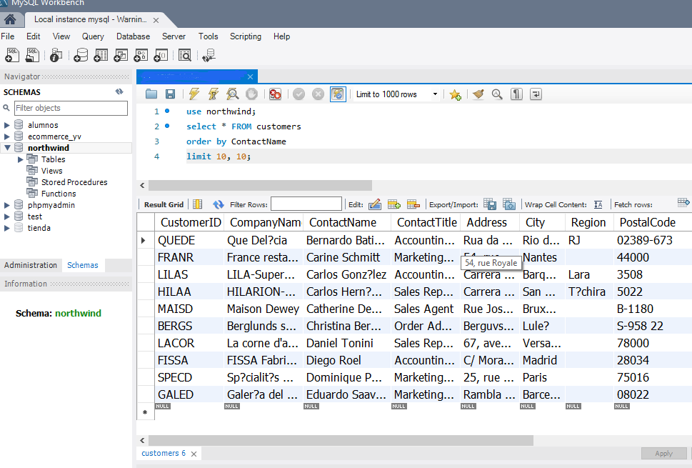

# Módulo 3 - Cláusula Select y Distinct

### Desafío 20



### Ejercicio 1
##### Ejecuta todos los campos de la tabla Customers




```SQL
use northwind;
select * FROM customers
```

### Ejercicio 2
##### Ejecuta una consulta de los campos: CustomerID, CompanyName, ContactName, ContactTitle, City, Phone y se ejecuta ordenada por CompanyName




```SQL
use northwind;
select CustomerID, CompanyName, ContactName, ContactTitle, City, Phone FROM customers
order by CompanyName;
```


### Ejercicio 3
##### Ejecuta unas consulta de los campos:  CustomerID, CompanyName, ContactName, ContactTitle y se ejecuta ordenada por ContactName de forma descendente




```SQL
use northwind;
select CustomerID, CompanyName, ContactName, ContactTitle FROM customers
order by ContactName desc;
```

### Ejercicio 4
##### Ejecuta todos los campos de la tabla Customers, Ordena por el campo CustomerID y Limita el total de registros a visualizar a 20



```SQL
use northwind;
select * FROM customers
order by ContactName
limit 10, 10;
```

### Ejercicio 5
##### Ejecuta todos los campos de la tabla Customers_ Ordena por ContactName y Limita el total de registros a visualizar, muestra solo 10 registros a partir del cliente número 10 de esta consulta resultante




```SQL
use northwind;
select * FROM customers
order by ContactName
limit 10, 10;
```


> Alumna: Yanina Velazquez