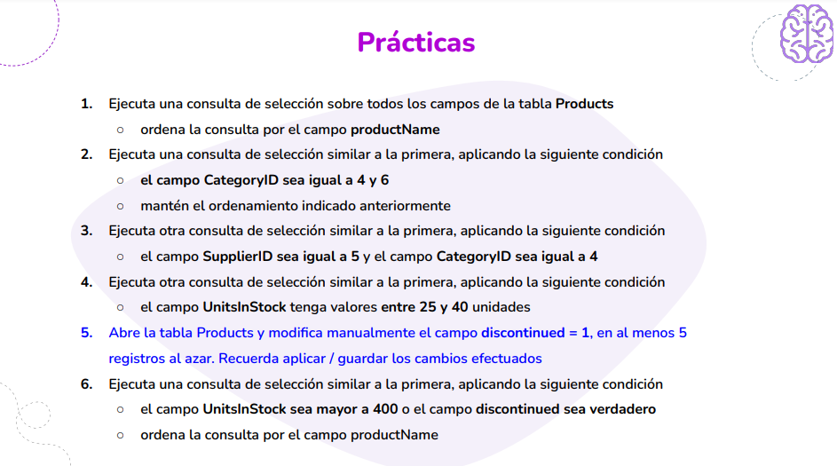
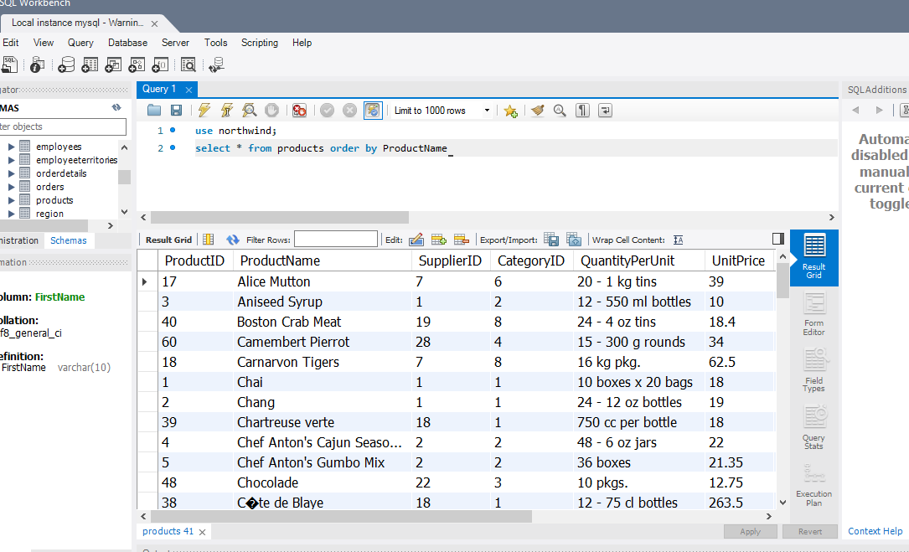
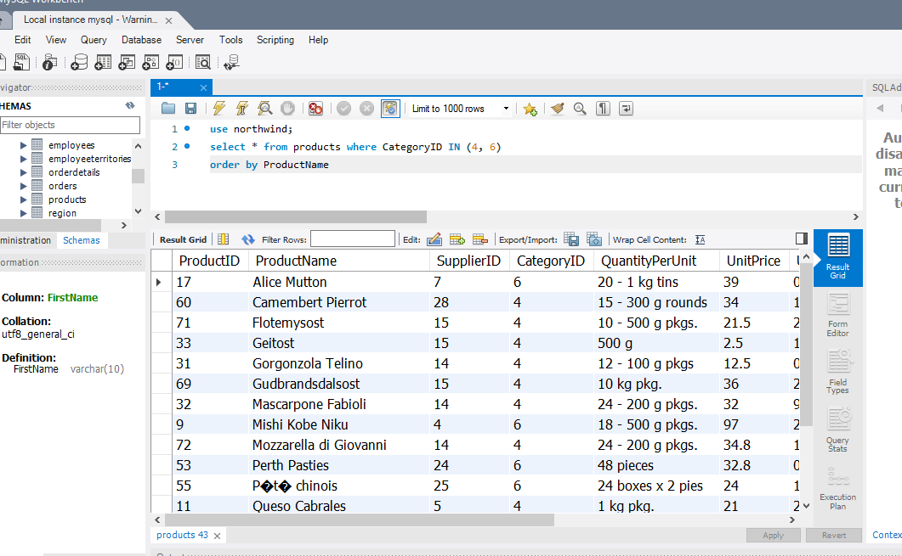
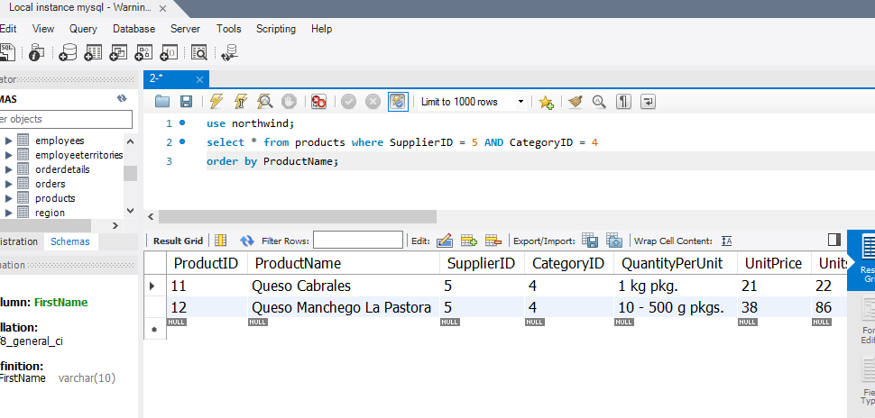
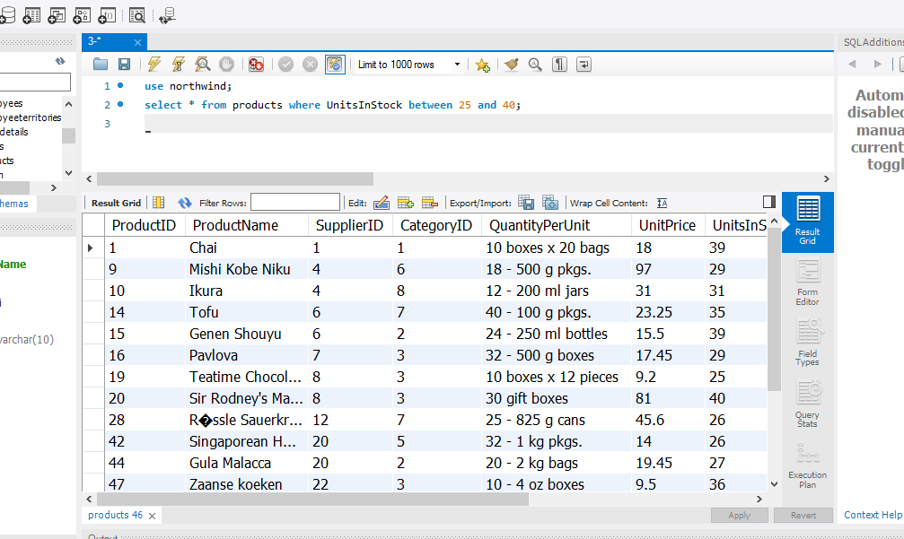
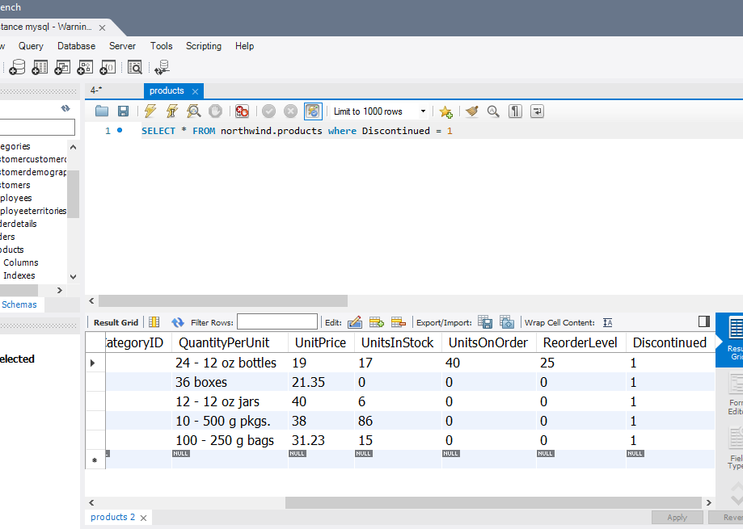
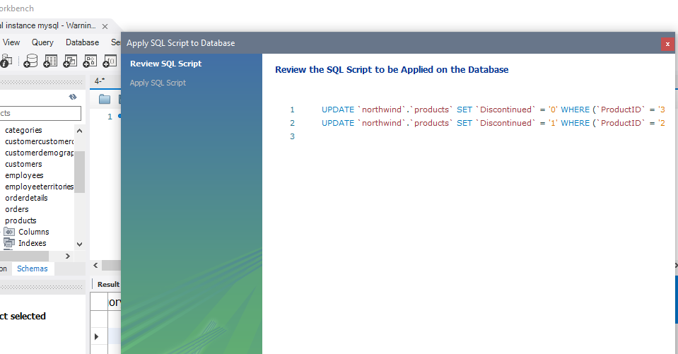
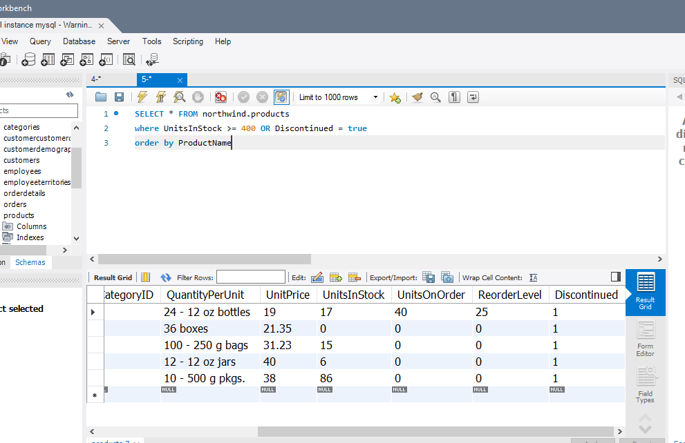

# Módulo 3 - Los operadores de comparación

### Desafío 21



### Ejercicio 1
##### Ejecuta todos los campos de la tabla Products ordenado por el campo productName



```SQL
use northwind;
select * from products
order by ProductName
```

### Ejercicio 2
##### Ejecuta  una consulta similar a la primera donde CategoryID sea igual a 4 y 6  ordenado por el campo productName



```SQL
use northwind;
select * from products
where CategoryID IN (4, 6)
order by ProductName
```

### Ejercicio 3
##### Ejecuta  una consulta similar a la primera donde el campo SupplierID sea igual a 5 y el campo CategoryID sea igual a 4



```SQL
use northwind;
select * from products
where SupplierID = 5 AND CategoryID = 4
order by ProductName;
```

### Ejercicio 4
##### Ejecuta  una consulta similar a la primera donde el campo UnitsInStock tenga valores entre 25 y 40 unidades



```SQL
use northwind;
select * from products 
where UnitsInStock 
between 25 and 40;
```


### Ejercicio 5
##### Se abre la tabla Products y se modifica manualmente el campo discontinued = 1




```SQL
SELECT * FROM northwind.products
where Discontinued = 1
```

###### Modificación del campo Discontinued




### Ejercicio 6
##### Ejecuta  una consulta similar a la primera donde el campo UnitsInStock sea mayor a 400 o el campo discontinued sea verdadero ordenado por el campo productName



```SQL
SELECT * FROM northwind.products 
where UnitsInStock >= 400 OR Discontinued = true
order by ProductName
```


> Alumna: Yanina Velazquez